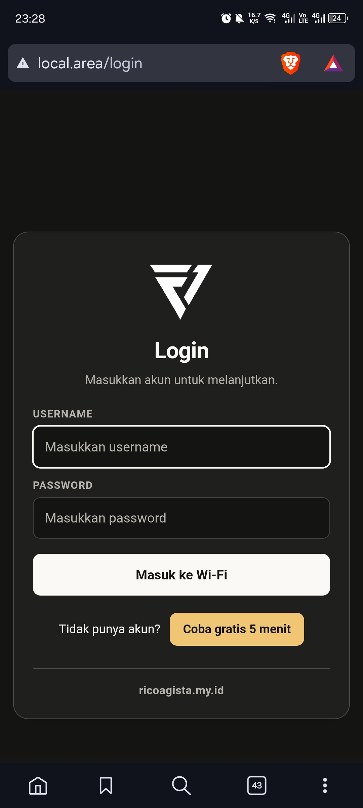
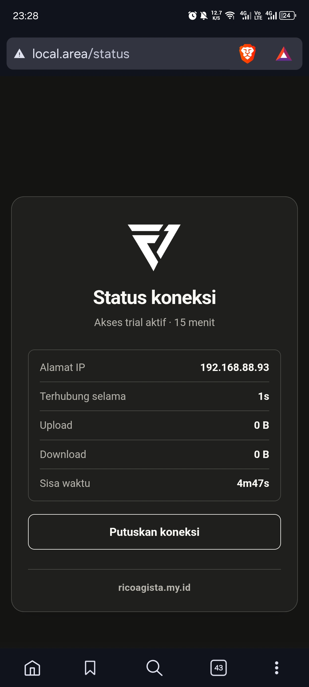
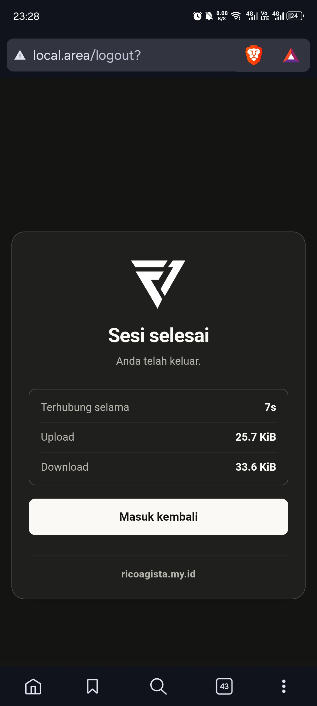

# MikroTik Hotspot Login

Template halaman autentikasi **MikroTik HotSpot** dengan tampilan sederhana, responsif, dan berbahasa Indonesia.

Template ini menyediakan halaman login Wi-Fi, akses trial, status koneksi, logout, halaman sukses, halaman akses berakhir, serta halaman error dengan gaya visual yang konsisten.

## Preview

### Login

<p align="center">
  
</p>

### Status koneksi

<p align="center">
  
</p>

### Logout

<p align="center">
  
</p>

> Gambar preview hanya untuk dokumentasi dan tidak perlu diunggah ke folder HotSpot pada router.

## Fitur

- Halaman login username dan password.
- Dukungan autentikasi CHAP MikroTik menggunakan `md5.js`.
- Tombol trial **Coba gratis 5 menit** jika fitur trial MikroTik aktif.
- Pengalihan otomatis ke halaman akses berakhir ketika batas waktu tercapai.
- Halaman status koneksi yang menampilkan:
  - Alamat IP
  - Durasi koneksi
  - Jumlah upload dan download
  - Sisa waktu sesi, jika tersedia
  - Sisa kuota, jika tersedia
- Halaman konfirmasi koneksi berhasil.
- Halaman logout dan tombol untuk masuk kembali.
- Halaman error dengan pesan dari MikroTik.
- Tampilan responsif untuk desktop dan perangkat seluler.
- Tema gelap dengan aksen kuning.
- Tautan website `ricoagista.my.id` yang konsisten di halaman utama.

## Struktur File

| File | Keterangan |
| --- | --- |
| `login.html` | Halaman login utama dan akses trial |
| `status.html` | Informasi status koneksi pengguna |
| `logout.html` | Halaman setelah pengguna keluar |
| `success.html` | Halaman setelah login berhasil |
| `expired.html` | Halaman ketika akses atau sesi telah berakhir |
| `error.html` | Halaman ketika terjadi kesalahan HotSpot |
| `redirect.html` | Pengalihan standar MikroTik |
| `alogin.html` | Pengalihan login untuk perangkat atau sistem tertentu |
| `rlogin.html` | Pengalihan login ke URL tujuan |
| `style.css` | Style global seluruh halaman |
| `md5.js` | Fungsi MD5 untuk autentikasi CHAP |
| `logo.avif` | Logo yang ditampilkan pada halaman |
| `images/login.jpg` | Preview halaman login |
| `images/status.jpg` | Preview halaman status koneksi |
| `images/logout.jpg` | Preview halaman logout |
| `errors.txt` | Pesan error MikroTik dalam bahasa utama |
| `errors-en.txt` | Pesan error MikroTik dalam bahasa Inggris |

## Persyaratan

- MikroTik RouterOS dengan fitur HotSpot aktif.
- HotSpot Server Profile yang menggunakan folder halaman HTML.
- Browser modern yang mendukung HTML5 dan CSS3.

## Instalasi

1. Aktifkan dan konfigurasi HotSpot pada MikroTik.
2. Siapkan folder halaman HotSpot, biasanya berada pada direktori:

   ```text
   /hotspot
   ```

3. Salin seluruh file proyek ini ke folder `hotspot` pada router.
4. Pastikan file halaman dan aset berikut tersedia pada folder yang sama:

   ```text
   login.html
   status.html
   logout.html
   success.html
   expired.html
   error.html
   redirect.html
   alogin.html
   rlogin.html
   style.css
   md5.js
   logo.avif
   errors.txt
   errors-en.txt
   ```

   File di folder `images` hanya digunakan sebagai preview di README, jadi tidak perlu disalin ke router.

5. Atur **HTML Directory** pada HotSpot Server Profile agar menunjuk ke folder tersebut.
6. Hubungkan perangkat ke jaringan HotSpot dan buka halaman login untuk menguji tampilan serta proses autentikasi.

File dapat diunggah menggunakan WinBox, WebFig, FTP, atau terminal MikroTik. Contoh menggunakan terminal:

```routeros
/file print
```

Setelah file diunggah, periksa kembali daftar file pada router menggunakan perintah tersebut.

## Konfigurasi Trial

Tombol trial hanya ditampilkan ketika variabel MikroTik berikut bernilai `yes`:

```text
$(if trial == 'yes')
```

Konfigurasi durasi trial tidak ditentukan oleh HTML. Atur durasi tersebut pada konfigurasi HotSpot MikroTik, misalnya melalui profil pengguna atau pengaturan trial yang digunakan router.

## Variabel MikroTik

Template ini menggunakan variabel bawaan MikroTik, antara lain:

```text
$(username)
$(password)
$(link-login-only)
$(link-login)
$(link-logout)
$(link-orig)
$(link-orig-esc)
$(mac-esc)
$(chap-id)
$(chap-challenge)
$(uptime)
$(bytes-in-nice)
$(bytes-out-nice)
$(session-time-left)
$(remain-bytes-total-nice)
$(error)
```

Jangan menghapus atau mengubah sintaks variabel `$(...)` jika file akan digunakan langsung sebagai halaman HotSpot MikroTik.

## Kustomisasi

### Mengganti logo

Ganti file berikut dengan logo milik Anda:

```text
logo.avif
```

Nama file dapat diubah, tetapi referensinya juga harus diperbarui pada setiap file HTML yang menggunakan elemen:

```html

```

### Mengubah warna

Warna utama dapat diubah pada bagian `:root` di `style.css`:

```css
:root {
    --bg: #141413;
    --surface: #1f1f1d;
    --ink: #faf9f5;
    --muted: #b6b4ad;
    --accent: #f0c674;
}
```

### Mengubah nama website

Cari dan ubah teks serta URL `ricoagista.my.id` pada file HTML yang menggunakannya. Pastikan URL pada atribut `href` tetap menggunakan alamat lengkap, contohnya:

```html
<a href="https://ricoagista.my.id" target="_blank" rel="noopener">
    ricoagista.my.id
</a>
```

## Pengujian

Setelah instalasi, uji alur berikut:

1. Membuka halaman login dari perangkat klien.
2. Login menggunakan akun HotSpot yang valid.
3. Memastikan halaman sukses dan status koneksi dapat dibuka.
4. Memastikan tombol **Putuskan koneksi** bekerja.
5. Menguji login trial jika fitur trial diaktifkan.
6. Menguji pesan error menggunakan kredensial yang tidak valid.
7. Menguji halaman akses berakhir setelah batas waktu tercapai.
8. Memeriksa tampilan pada layar desktop dan perangkat seluler.

## Catatan Keamanan

- Gunakan HTTPS pada layanan dan jaringan yang mendukungnya.
- Jangan menaruh username, password, atau kredensial router di dalam file HTML.
- Ubah kredensial admin MikroTik bawaan sebelum dipakai di lingkungan produksi.
- Batasi durasi serta kuota akun trial sesuai kebutuhan jaringan.
- Tinjau konfigurasi firewall dan daftar pengguna HotSpot secara berkala.

## Lisensi

Proyek ini menggunakan [Lisensi MIT](./LICENSE). Lihat file [LICENSE](./LICENSE)
untuk teks lengkap lisensinya.
